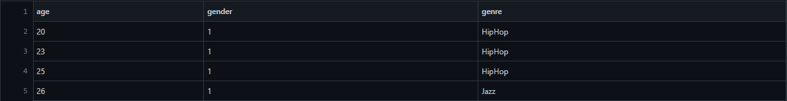
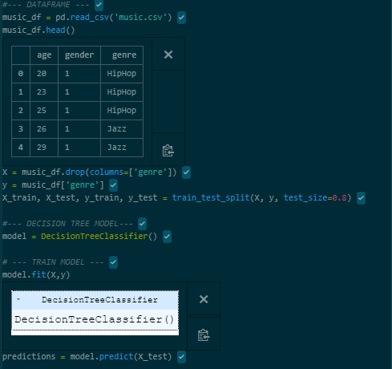
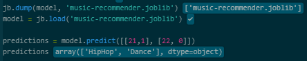

## Music-Type-Prediction

My first machine learning project! :smile: 

In this simple project, I will predict the best type of music based on gender and age. The data wiil be music.csv.

__The head of music.csv:__

I used Train Test Split to train the model.
And then, I used Decision Tree Classifier Model to predict suitable type of music based on gender and age.

After that,  I tried to calculate the accuracy score, it seems that I always got 100% accuracy probably because the data was too small.

Then, I tried to do persistence model using joblib. This one is for practise purposes.

The last part, I tried to visualize the tree for study purpose.

In conclusion, the data was too small, so the result wasn't accurate.

